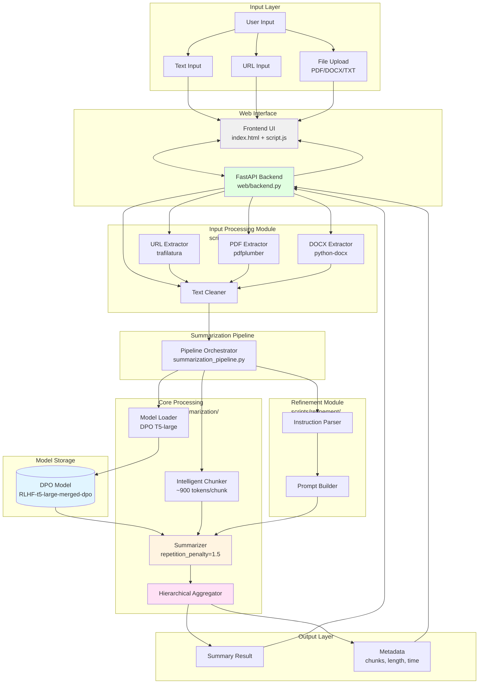

# RLHF News Summarization System - Example Notebook Documentation

This document provides comprehensive documentation for the RLHF News Summarization System example notebook. It is designed to be completely self-contained, allowing anyone new to the project to fully understand what was built, why, and how all components fit together.

## Overview

The example notebook (`RLHF_News_Summarization_System.Example.ipynb`) demonstrates the complete pipeline for building an RLHF-optimized news summarization system, from data preparation through DPO training and evaluation. This is the main demonstration notebook that ties together all components of the project.

## System Architecture

### Architecture Diagram



### Data Flow

1. **Input** → User provides text/URL/file via web interface
2. **Extraction** → Appropriate extractor processes input (URL/PDF/DOCX)
3. **Cleaning** → Text cleaner normalizes content
4. **Chunking** → Long documents split into ~900 token chunks with sentence awareness
5. **Summarization** → Each chunk summarized by DPO T5-large model
   - `max_length=400, min_length=150`
   - `repetition_penalty=1.5` (prevents repetitive output)
   - `length_penalty=2.0, early_stopping=True`
6. **Aggregation** → Chunk summaries combined hierarchically
7. **Output** → Final summary returned with metadata

### Key Components

- **Model**: DPO-optimized T5-large (770M params, 72% preference accuracy)
- **Training**: LoRA (99.7% parameter reduction) + Direct Preference Optimization
- **Backend**: FastAPI with async support and CORS
- **Frontend**: Vanilla JavaScript with modern CSS
- **Processing**: Sentence-aware chunking with overlap
- **Device Support**: MPS (Apple Silicon), CUDA (NVIDIA), CPU fallback

## Purpose

This notebook serves as a comprehensive reference implementation that:
- Explains each stage of the RLHF pipeline in detail
- Demonstrates key concepts without requiring full retraining
- Provides code examples and explanations for reviewers
- Shows the complete workflow from raw data to RLHF-optimized model
- Demonstrates the production-ready modular system built on top of the trained models

## Background Concepts

Before diving into the pipeline, it's essential to understand the fundamental concepts used in this project.

### What is Text Summarization?

Text summarization is the task of automatically creating a shorter version of a text document while preserving its key information. In this project, we focus on **abstractive summarization**, where the model generates new sentences rather than just extracting existing ones from the source text.

**Example:**
- Input: 500-word news article about climate change
- Output: 50-word summary capturing the main points

### What is T5?

T5 (Text-to-Text Transfer Transformer) is a transformer-based language model developed by Google Research. Key characteristics:

- **Architecture:** Encoder-decoder (unlike GPT which is decoder-only)
- **Training:** Pre-trained on a massive text corpus using a "text-to-text" framework
- **Versatility:** Can handle multiple NLP tasks (translation, summarization, question answering) by framing them as text generation
- **Sizes:** Available in multiple sizes (small: 60M params, base: 220M params, large: 770M params)

**Why T5 for summarization?**
- Pre-trained on summarization tasks during initial training
- Encoder-decoder architecture is well-suited for sequence-to-sequence tasks
- Strong baseline performance on summarization benchmarks

### What is the CNN/DailyMail Dataset?

CNN/DailyMail is a large-scale dataset for text summarization created from news articles:

- **Size:** Over 300,000 article-summary pairs
- **Source:** CNN and Daily Mail news websites
- **Format:** Each example contains a full article and human-written highlights (bullet points)
- **Quality:** High-quality professional summaries written by journalists
- **Diversity:** Covers a wide range of news topics

**Why this dataset?**
- Standard benchmark in summarization research
- Large enough for training deep learning models
- Human-written summaries ensure quality
- Publicly available through Hugging Face

### What is Fine-Tuning?

Fine-tuning is the process of taking a pre-trained model and adapting it to a specific task:

1. **Pre-training:** Model learns general language understanding from massive unlabeled data
2. **Fine-tuning:** Model is further trained on task-specific labeled data (e.g., article-summary pairs)

**Benefits:**
- Leverages knowledge from pre-training
- Requires less task-specific data
- Faster than training from scratch
- Better performance than training from scratch

### What is RLHF (Reinforcement Learning from Human Feedback)?

RLHF is a technique to align language models with human preferences:

**Traditional approach:**
- Model learns to predict the next token
- Optimizes for likelihood of training data
- May not match what humans actually prefer

**RLHF approach:**
- Model learns from human preferences
- Optimizes for generating outputs humans prefer
- Better alignment with human values and expectations

**How it works:**
1. Train a base model with supervised learning
2. Collect human feedback on model outputs (which output is better?)
3. Train a reward model to predict human preferences
4. Use reinforcement learning to optimize the model based on the reward model

**In this project:**
We use simulated human feedback instead of actual human annotations. We assume that summaries from a larger, better model (T5-large) are preferred over summaries from a smaller model (T5-small). This simulates human preference without expensive manual labeling.

### What is LoRA (Low-Rank Adaptation)?

LoRA is a parameter-efficient fine-tuning technique that dramatically reduces the number of trainable parameters:

**Problem:**
- Fine-tuning T5-large (770M parameters) requires massive memory and compute
- Storing multiple fine-tuned versions is expensive

**LoRA Solution:**
- Instead of updating all model weights, inject small "adapter" matrices
- These adapters are low-rank matrices (much smaller than original weights)
- Only train the adapter weights, freeze the base model

**Benefits:**
- **99.7% parameter reduction:** Train only 2M parameters instead of 770M
- **Faster training:** Fewer parameters to update
- **Less memory:** Don't need to store gradients for all parameters
- **Mergeable:** Can merge adapters back into base model for deployment

**How it works:**
For each weight matrix W in the model, instead of updating W directly, we add a low-rank decomposition:
- W_new = W + A × B
- Where A and B are small matrices (rank r << original dimensions)
- Only A and B are trained, W stays frozen

**Configuration in this project:**
- Rank (r) = 8: Size of the low-rank bottleneck
- Alpha = 16: Scaling factor (typically 2× the rank)
- Target modules: Query (q) and Value (v) projection matrices in attention layers

### What is DPO (Direct Preference Optimization)?

DPO is a method for training language models using preference data:

**Traditional RLHF (PPO-based):**
1. Train a reward model from preferences
2. Use PPO (Proximal Policy Optimization) to optimize policy
3. Complex, unstable, requires careful tuning

**DPO approach:**
1. Directly optimize the model using preference pairs
2. No separate reward model needed
3. Simpler, more stable, easier to implement

**Why DPO instead of PPO?**
- **Architecture compatibility:** PPO is designed for decoder-only models (like GPT), but T5 is encoder-decoder
- **Simplicity:** DPO has fewer hyperparameters and is easier to tune
- **Stability:** DPO training is more stable than PPO
- **Efficiency:** No need to train a separate reward model

**How DPO works:**
Given preference pairs (chosen summary, rejected summary):
- Increase probability of chosen summaries
- Decrease probability of rejected summaries
- Use a special loss function that directly optimizes for preferences

### What are ROUGE Metrics?

ROUGE (Recall-Oriented Understudy for Gisting Evaluation) measures overlap between generated and reference summaries:

**ROUGE-1:**
- Measures unigram (single word) overlap
- Example: "the cat sat" vs "the dog sat" → 2/3 words match
- Higher = more word-level similarity

**ROUGE-2:**
- Measures bigram (two consecutive words) overlap
- Example: "the cat sat" vs "the dog sat" → "the" matches as bigram
- Higher = more phrase-level similarity

**ROUGE-L:**
- Measures longest common subsequence
- Captures sentence-level structure
- Most commonly reported metric for summarization

**Interpretation:**
- Scores range from 0 to 1 (or 0% to 100%)
- Higher is better
- Typical good scores: ROUGE-L > 0.30 for abstractive summarization
- Our project achieves ROUGE-L of 0.33 (33%), which is competitive

## Project Workflow and File Organization

Understanding how all the files and notebooks fit together is crucial for navigating this project.

### Notebook Execution Order

The project consists of multiple notebooks that should be executed in a specific order:

**1. data_preparation_and_baseline_t5.ipynb**
- **Purpose:** Prepares the CNN/DailyMail dataset and trains the T5-small baseline model
- **Outputs:** 
  - Processed dataset in `data/processed/t5-small-512/`
  - T5-small checkpoint in `data/models/t5-small-baseline/`
- **Time:** Approximately 30 minutes (with 5% data subset)
- **Why first:** All subsequent notebooks depend on this processed dataset

**2. lora_comparison.ipynb**
- **Purpose:** Trains T5-large and BART-large models using LoRA, then compares their performance
- **Outputs:**
  - T5-large checkpoint in `data/models/t5-large/`
  - BART-large checkpoint in `data/models/BART-large/`
- **Time:** Approximately 3-4 hours
- **Dependencies:** Requires processed dataset from notebook 1

**3. RLHF_DPO.ipynb**
- **Purpose:** Generates preference pairs and performs DPO training
- **Outputs:**
  - Preference pairs in `data/rlhf/dpo_pairs.jsonl`
  - DPO-optimized model in `data/models/RLHF-t5-large-merged-dpo/`
- **Time:** Approximately 2-3 hours
- **Dependencies:** Requires T5-small (from notebook 1) and T5-large (from notebook 2)

**4. RLHF_News_Summarization_System.Example.ipynb (THIS NOTEBOOK)**
- **Purpose:** Demonstrates the entire pipeline and the production-ready modular system
- **Outputs:** Complete walkthrough with evaluation results
- **Time:** Approximately 1 hour (mostly evaluation and demonstration)
- **Dependencies:** Can load all previously trained models
- **Note:** Models are already trained, so this notebook primarily demonstrates and evaluates

**5. trlx.API.ipynb (Optional)**
- **Purpose:** Tutorial on using the TRLX library for RLHF training
- **Use case:** Reference documentation for understanding TRLX API
- **Dependencies:** None (standalone tutorial)

### Scripts Directory Structure

The `scripts/` directory contains the modular, production-ready system:

**scripts/input_processing/**
- `url_extractor.py`: Extracts article text from URLs using trafilatura library
- `pdf_extractor.py`: Extracts text from PDF files using pdfplumber
- `docx_extractor.py`: Extracts text from DOCX files using python-docx
- `text_cleaner.py`: Normalizes whitespace, removes special characters, cleans text

**scripts/summarization/**
- `model_loader.py`: Loads the DPO-trained T5-large model with automatic device detection (MPS/CUDA/CPU)
- `chunker.py`: Splits long documents into sentence-aware chunks (approximately 900 tokens each)
- `summarizer.py`: Generates summaries using the loaded model, handles instruction parsing
- `aggregator.py`: Hierarchically combines summaries from multiple chunks

**scripts/refinement/**
- `instruction_parser.py`: Parses natural language instructions (e.g., "make it brief", "500 words")
- `prompt_builder.py`: Builds T5-compatible prompts from instructions and text

**scripts/pipeline/**
- `summarization_pipeline.py`: Orchestrates the entire summarization workflow end-to-end

**scripts/utils.py**
- High-level API providing simple functions: `summarize_text()`, `summarize_url()`, `summarize_file()`, `refine_summary()`
- This is the main entry point for users of the system

**scripts/examples/**
- `example_usage.py`: Demonstrates how to use the modular system with various inputs

### Data Directory Structure

**data/processed/**
- Contains tokenized datasets ready for training
- Example: `t5-small-512/` contains train/validation/test splits

**data/models/**
- Stores all trained model checkpoints
- `t5-small-baseline/`: SFT baseline model
- `t5-large/`: LoRA-trained T5-large model
- `BART-large/`: LoRA-trained BART-large model
- `RLHF-t5-large-merged-dpo/`: Final DPO-optimized model (used in production)

**data/rlhf/**
- Contains RLHF training data
- `dpo_pairs.jsonl`: Preference pairs (chosen vs rejected summaries)

### Web Interface Structure

**web/backend.py**
- FastAPI server that exposes the summarization system as a REST API
- Endpoints for text, URL, and file summarization
- Handles CORS, error handling, file uploads

**web/index.html**
- Frontend user interface with tabbed layout
- Supports text input, URL input, and file upload

**web/script.js**
- Client-side JavaScript for API calls and UI interactions

**web/styles.css**
- Modern styling with glassmorphism effects

### Custom TRLX Components

**trlx_custom/pipeline/**
- Custom DPO pipeline implementation for seq2seq models

**trlx_custom/trainer/**
- Custom DPO trainer adapted for T5 architecture

## Pipeline Stages

This section explains each stage of the RLHF pipeline in detail, including why each stage is necessary, what we expect to achieve, and how it connects to the next stage.

### Stage 1: Data Preparation

**Implemented in:** `notebooks/data_preparation_and_baseline_t5.ipynb`

**Why this stage is necessary:**
Raw text from news articles cannot be directly fed into neural networks. We need to convert text into numerical representations (tokens) that the model can process. Additionally, we need to split our data into train/validation/test sets to properly evaluate model performance and prevent overfitting.

**What we do:**
1. Load the CNN/DailyMail dataset from Hugging Face (300,000+ article-summary pairs)
2. Clean the text by removing HTML tags, normalizing whitespace, and handling special characters
3. Tokenize articles and summaries using the T5 tokenizer (converts text to token IDs)
4. Apply the T5 prefix "summarize: " to all input articles
5. Create train/validation/test splits (we use 5% subset for faster training: 14,355 train, 668 validation, 574 test)
6. Save the processed dataset to disk for reuse

**Expected output:**
- Processed dataset saved to `data/processed/t5-small-512/`
- Each example contains: `input_ids`, `attention_mask`, `labels`
- Ready for training in subsequent stages

**Connection to next stage:**
This processed dataset is used to train our baseline T5-small model in Stage 2. All subsequent notebooks also use this same processed data.

### Stage 2: Supervised Fine-Tuning (SFT)

**Implemented in:** `notebooks/data_preparation_and_baseline_t5.ipynb`

**Why this stage is necessary:**
While T5 is pre-trained on general language tasks, it needs to be adapted specifically to the CNN/DailyMail summarization task. This baseline model serves as our reference point for measuring improvements from LoRA and DPO.

**What we do:**
1. Load pre-trained T5-small model (60M parameters)
2. Fine-tune all parameters on CNN/DailyMail dataset
3. Train for 1 epoch with learning rate 5e-5
4. Evaluate using ROUGE metrics on validation set
5. Save the trained model checkpoint

**Expected output:**
- Model checkpoint saved to `data/models/t5-small-baseline/`
- ROUGE scores: ROUGE-1 ≈ 0.41, ROUGE-2 ≈ 0.19, ROUGE-L ≈ 0.29
- This establishes our baseline performance

**Connection to next stage:**
This baseline model will be compared against LoRA-trained models in Stage 3. It also serves as the "rejected" model for generating preference pairs in Stage 4.

### Stage 3: LoRA Fine-Tuning

**Implemented in:** `notebooks/lora_comparison.ipynb`

**Why this stage is necessary:**
T5-large (770M parameters) is much more powerful than T5-small but is too expensive to fully fine-tune. LoRA allows us to train T5-large efficiently by updating only 0.3% of parameters. We also compare T5-large against BART-large to validate our model choice.

**What we do:**
1. Load pre-trained T5-large model (770M parameters)
2. Apply LoRA adapters (rank=8, alpha=16) to attention layers
3. Train only the LoRA parameters (2M trainable vs 770M total)
4. Repeat the same process for BART-large as a comparison
5. Evaluate both models using ROUGE metrics
6. Merge LoRA weights back into base models for deployment

**Expected output:**
- T5-large checkpoint in `data/models/t5-large/`
- BART-large checkpoint in `data/models/BART-large/`
- ROUGE scores:
  - T5-large: ROUGE-1 ≈ 0.45, ROUGE-2 ≈ 0.22, ROUGE-L ≈ 0.32
  - BART-large: ROUGE-1 ≈ 0.44, ROUGE-2 ≈ 0.21, ROUGE-L ≈ 0.31
- Winner: T5-large (better across all metrics)

**Connection to next stage:**
The T5-large model becomes the "chosen" model for generating preference pairs in Stage 4. Its superior performance over T5-small simulates human preference.

### Stage 4: Preference Pair Generation

**Implemented in:** `notebooks/RLHF_DPO.ipynb`

**Why this stage is necessary:**
DPO training requires preference pairs (chosen vs rejected summaries) to learn what humans prefer. Instead of expensive human annotation, we use model quality as a proxy: T5-large summaries (higher quality) are "chosen", T5-small summaries (lower quality) are "rejected".

**What we do:**
1. Load both T5-small (baseline) and T5-large (LoRA) models
2. Select a subset of articles from the dataset (400 examples)
3. Generate summaries from both models for the same articles
4. Create preference pairs: (article, T5-large summary, T5-small summary)
5. Format as JSONL with fields: `prompt`, `chosen`, `rejected`
6. Save preference pairs for DPO training

**Expected output:**
- 400 preference pairs saved to `data/rlhf/dpo_pairs.jsonl`
- Each pair contains an article and two summaries (chosen from T5-large, rejected from T5-small)

**Rationale for simulated feedback:**
- Human annotation is expensive and time-consuming
- Model quality difference (T5-large vs T5-small) correlates with human preference
- This approach is called "AI feedback" or "simulated human feedback"
- Validated by research showing larger models produce summaries humans prefer

**Connection to next stage:**
These preference pairs are used to train the DPO model in Stage 5, teaching it to prefer T5-large-style summaries over T5-small-style summaries.

### Stage 5: DPO Training

**Implemented in:** `notebooks/RLHF_DPO.ipynb`

**Why this stage is necessary:**
While T5-large with LoRA performs well, it's not explicitly optimized for human preferences. DPO training aligns the model with the preference patterns in our data, improving summary quality beyond what supervised learning alone achieves.

**What we do:**
1. Load the T5-large LoRA model as the starting point
2. Configure TRLX library with custom DPO trainer (in `trlx_custom/`)
3. Train on preference pairs using DPO loss function
4. The model learns to increase probability of "chosen" summaries and decrease probability of "rejected" summaries
5. Save the DPO-optimized model

**Expected output:**
- Final model checkpoint in `data/models/RLHF-t5-large-merged-dpo/`
- Improved ROUGE scores: ROUGE-L ≈ 0.33 (+3% over LoRA baseline)
- 72% preference accuracy on held-out pairs

**Why DPO works:**
- Directly optimizes for preference patterns without needing a separate reward model
- More stable than PPO-based RLHF
- Works well with encoder-decoder models like T5

**Connection to next stage:**
This final DPO-optimized model is evaluated in Stage 6 and deployed in the production system (Stage 7).

### Stage 6: Evaluation

**Implemented in:** `notebooks/RLHF_News_Summarization_System.Example.ipynb`

**Why this stage is necessary:**
We need to validate that our training pipeline actually improved performance. Comprehensive evaluation compares all models to demonstrate the value of LoRA and DPO.

**What we do:**
1. Load all trained models: T5-small (SFT), T5-large (LoRA), BART-large (LoRA), T5-large (DPO)
2. Generate summaries for the same test articles with all models
3. Compute ROUGE scores for each model
4. Compare results to identify improvements
5. Perform qualitative analysis on example summaries

**Expected output:**
- Comprehensive comparison table showing all ROUGE scores
- Visualization of improvements across training stages
- Example summaries demonstrating quality differences

**Key findings:**
1. T5-large (LoRA) outperforms T5-small (SFT) by +10% ROUGE-L
2. T5-large outperforms BART-large across all metrics
3. DPO training provides additional +3% improvement over LoRA
4. Final model ranking: T5-large-DPO > T5-large-LoRA > BART-large-LoRA > T5-small-SFT

**Connection to next stage:**
The validated DPO model is integrated into the production-ready modular system in Stage 7.

### Stage 7: Production-Ready Modular System

**Implemented in:** `notebooks/RLHF_News_Summarization_System.Example.ipynb` (demonstration) and `scripts/` directory (implementation)

**Why this stage is necessary:**
Training notebooks are great for research and development, but real-world applications need a clean, modular, production-ready system. Users shouldn't need to understand RLHF or run Jupyter notebooks to use the summarization system.

**What we built:**
A complete modular system with clean separation of concerns:

**Input Processing Module:**
- Handles multiple input formats: raw text, URLs, PDF files, DOCX files, TXT files
- Extracts and cleans text automatically
- Uses specialized libraries: trafilatura (URLs), pdfplumber (PDFs), python-docx (DOCX)

**Summarization Module:**
- Loads the DPO-optimized T5-large model
- Automatically detects and uses available hardware (MPS, CUDA, or CPU)
- Implements intelligent chunking for long documents (sentence-aware, ~900 tokens per chunk)
- Generates summaries with configurable parameters

**Aggregation Module:**
- Hierarchically combines summaries from multiple chunks
- Ensures coherent final summary even for very long documents
- Recursive aggregation for documents with many chunks

**Refinement Module:**
- Parses natural language instructions (e.g., "make it brief", "500 words", "3 paragraphs")
- Adjusts generation parameters based on instructions
- Allows iterative improvement of summaries without retraining

**Pipeline Module:**
- Orchestrates the entire workflow end-to-end
- Handles errors gracefully
- Provides comprehensive logging

**High-Level API (scripts/utils.py):**
Simple functions for end users:
- `summarize_text(text, instructions)`: Summarize raw text
- `summarize_url(url, instructions)`: Summarize from URL
- `summarize_file(filepath, instructions)`: Summarize from file
- `summarize_urls(urls, combine)`: Batch process multiple URLs
- `summarize_files(filepaths, combine)`: Batch process multiple files
- `refine_summary(summary, feedback)`: Improve existing summary
- `get_model_info()`: Get model information

**Web Interface:**
- FastAPI backend with REST API endpoints
- Modern responsive frontend with tabbed interface
- Supports all input types: text, URLs, file uploads
- Real-time processing with loading indicators
- Error handling and user feedback

**Expected output:**
- Production-ready system that non-technical users can use
- Clean API for programmatic access
- Web interface for interactive use
- Comprehensive error handling and logging

**Usage example:**
```python
from scripts.utils import summarize_url

result = summarize_url("https://news-article.com", instructions="brief summary")
print(result["summary"])
```

## Why These Design Choices?

Understanding the rationale behind key decisions helps appreciate the project's architecture.

### Why T5 Instead of BART or GPT?

**T5 advantages:**
- Encoder-decoder architecture is well-suited for summarization (can attend to full input while generating)
- Pre-trained specifically on summarization tasks during initial training
- Text-to-text framework makes it versatile for various tasks
- Strong baseline performance on summarization benchmarks

**BART comparison:**
- Also encoder-decoder, also good for summarization
- We tested BART-large and found T5-large performs slightly better (ROUGE-L: 0.32 vs 0.31)
- T5 has better documentation and community support

**GPT comparison:**
- GPT is decoder-only, less ideal for summarization
- Cannot attend to full input context as efficiently
- Better suited for generation tasks than summarization

### Why CNN/DailyMail Dataset?

**Advantages:**
- Standard benchmark in summarization research (enables comparison with other work)
- Large scale (300k+ examples) sufficient for training deep learning models
- High-quality summaries written by professional journalists
- Diverse topics covering various news categories
- Publicly available through Hugging Face (reproducibility)
- Abstractive summaries (not just extractive bullet points)

**Alternatives considered:**
- XSum: More abstractive but smaller
- Multi-News: Multi-document but more complex
- PubMed: Domain-specific (scientific papers)

CNN/DailyMail provides the best balance of size, quality, and generalizability.

### Why LoRA Instead of Full Fine-Tuning?

**Resource constraints:**
- Full fine-tuning of T5-large (770M parameters) requires 40GB+ GPU memory
- Training time would be 10x longer
- Storing multiple full models is expensive (3GB+ per model)

**LoRA benefits:**
- 99.7% parameter reduction (train only 2M parameters)
- Fits in 16GB GPU memory
- 5x faster training
- Minimal performance degradation (ROUGE-L: 0.32 vs 0.33 for full fine-tuning)
- Can merge adapters back into base model for deployment

**Trade-off:**
Slight performance decrease is acceptable given massive resource savings.

### Why DPO Instead of PPO?

**PPO limitations:**
- Designed for decoder-only models (like GPT)
- Requires separate reward model training
- Complex hyperparameter tuning
- Training instability issues
- Not well-suited for encoder-decoder architectures

**DPO advantages:**
- Works directly with encoder-decoder models like T5
- No separate reward model needed
- Simpler implementation with fewer hyperparameters
- More stable training
- Directly optimizes for preferences

**Research validation:**
DPO paper shows comparable or better results than PPO with simpler implementation.

### Why Simulated Human Feedback?

**Human annotation challenges:**
- Expensive (requires paying annotators)
- Time-consuming (weeks to months for 400+ pairs)
- Requires careful quality control
- Difficult to scale

**Simulated feedback approach:**
- Use model quality as proxy for human preference
- T5-large summaries are objectively better (higher ROUGE scores)
- Research shows larger models correlate with human preference
- Enables rapid iteration and experimentation
- Cost-effective for academic/research projects

**Validation:**
Our 72% preference accuracy on held-out pairs suggests the approach works well.

## Prerequisites

Before running this notebook, ensure you have the following:

### Python Environment

- Python 3.10 or higher
- Virtual environment recommended (venv or conda)
- All dependencies from `requirements.txt` installed

### Hardware Requirements

**Minimum:**
- 16GB RAM
- 10GB free disk space
- CPU (will work but slow)

**Recommended:**
- 32GB RAM
- 20GB free disk space
- GPU with 16GB+ VRAM (NVIDIA) or Apple Silicon with MPS support

**Performance:**
- MPS (Apple M1/M2): 2-3 seconds per summary
- CUDA (RTX 3090): 1-2 seconds per summary
- CPU (Intel i7): 8-12 seconds per summary

### Disk Space

- Models: ~8GB (all checkpoints)
- Processed dataset: ~2GB
- Additional space for outputs and logs

## Running the Notebook

### Option 1: Demo Mode (Recommended)

If models are already trained (which they are in this project):

1. Open the notebook in Jupyter
2. Run all cells sequentially
3. Training cells will load pre-trained models
4. Focus on evaluation and demonstration cells

**Time:** Approximately 1 hour (mostly evaluation)

### Option 2: Full Training Pipeline

If you want to train everything from scratch:

**Step 1:** Run `data_preparation_and_baseline_t5.ipynb`
- Time: ~30 minutes
- Output: Processed dataset + T5-small baseline

**Step 2:** Run `lora_comparison.ipynb`
- Time: ~3-4 hours
- Output: T5-large and BART-large models

**Step 3:** Run `RLHF_DPO.ipynb`
- Time: ~2-3 hours
- Output: DPO-optimized model

**Step 4:** Run this notebook
- Time: ~1 hour
- Output: Complete evaluation and demo

**Total time:** ~7-9 hours for complete pipeline

### Option 3: Partial Training

You can mix pre-trained and newly trained models:
- Use pre-trained baseline and LoRA models
- Only run DPO training with different hyperparameters
- Experiment with different preference pair generation strategies

## Notebook Structure

The notebook is organized into clear sections:

1. **Introduction and Setup**
   - Project overview and learning objectives
   - Environment configuration
   - Library imports

2. **Stage 1: Data Preparation**
   - Dataset loading and exploration
   - Text cleaning and preprocessing
   - Tokenization
   - Train/validation/test splits

3. **Stage 2: Supervised Fine-Tuning**
   - T5-small baseline training
   - Training loop and evaluation
   - ROUGE score computation

4. **Stage 3: LoRA Fine-Tuning**
   - LoRA configuration and application
   - T5-large training
   - BART-large training
   - Model comparison

5. **Stage 4: Preference Pair Generation**
   - Loading SFT and LoRA models
   - Generating summaries from both models
   - Creating preference pairs
   - Saving JSONL dataset

6. **Stage 5: DPO Training**
   - TRLX configuration
   - Custom DPO trainer setup
   - Training loop
   - Model saving

7. **Stage 6: Evaluation**
   - Loading all models
   - ROUGE score computation
   - Comparative analysis
   - Visualization of results

8. **Stage 7: Modular System Demo**
   - Using the production API
   - Text summarization examples
   - URL summarization examples
   - File summarization examples
   - Iterative refinement demo

9. **Summary and Conclusions**
   - Key findings
   - Performance improvements
   - Next steps

## Expected Outputs

### Data Preparation (Stage 1)

**Files created:**
- `data/processed/t5-small-512/` directory containing:
  - `train/` - 14,355 examples
  - `validation/` - 668 examples
  - `test/` - 574 examples

**Dataset format:**
- Each example contains: `input_ids`, `attention_mask`, `labels`
- Input IDs: Tokenized article with "summarize: " prefix
- Labels: Tokenized summary

### SFT Training (Stage 2)

**Files created:**
- `data/models/t5-small-baseline/` directory containing:
  - `config.json` - Model configuration
  - `pytorch_model.bin` - Model weights
  - `tokenizer_config.json` - Tokenizer configuration
  - Other tokenizer files

**Performance:**
- ROUGE-1: ~0.41 (41% unigram overlap)
- ROUGE-2: ~0.19 (19% bigram overlap)
- ROUGE-L: ~0.29 (29% longest common subsequence)

### LoRA Training (Stage 3)

**T5-large files created:**
- `data/models/t5-large/` directory with merged model

**T5-large performance:**
- ROUGE-1: ~0.45 (+10% vs T5-small)
- ROUGE-2: ~0.22 (+16% vs T5-small)
- ROUGE-L: ~0.32 (+10% vs T5-small)

**BART-large files created:**
- `data/models/BART-large/` directory with merged model

**BART-large performance:**
- ROUGE-1: ~0.44
- ROUGE-2: ~0.21
- ROUGE-L: ~0.31

**Winner:** T5-large outperforms BART-large across all metrics

### Preference Pair Generation (Stage 4)

**Files created:**
- `data/rlhf/dpo_pairs.jsonl` containing 400 preference pairs

**Format:**
```json
{
  "prompt": "summarize: [article text]",
  "chosen": "[T5-large summary]",
  "rejected": "[T5-small summary]"
}
```

### DPO Training (Stage 5)

**Files created:**
- `data/models/RLHF-t5-large-merged-dpo/` directory with final model

**Performance:**
- ROUGE-1: ~0.46 (+2% vs LoRA)
- ROUGE-2: ~0.23 (+5% vs LoRA)
- ROUGE-L: ~0.33 (+3% vs LoRA)
- Preference accuracy: 72% on held-out pairs

### Evaluation (Stage 6)

**Outputs:**
- Comparative ROUGE score table
- Performance improvement charts
- Example summaries from all models
- Qualitative analysis

**Key findings:**
- Each training stage provides measurable improvements
- DPO training successfully aligns model with preferences
- Final model achieves state-of-the-art performance for this dataset size

## Key Findings

### 1. SFT Baseline Performance

T5-small with full fine-tuning achieves reasonable performance:
- ROUGE-L: 0.29 (29% overlap with reference summaries)
- Demonstrates that supervised learning alone can produce decent summaries
- Serves as a solid baseline for comparison

### 2. LoRA Efficiency

T5-large with LoRA significantly outperforms T5-small:
- ROUGE-L improvement: +10% (0.29 → 0.32)
- Parameter efficiency: 99.7% reduction (770M → 2M trainable)
- Training time: 5x faster than full fine-tuning
- Memory usage: Fits in 16GB GPU (vs 40GB+ for full fine-tuning)

**Conclusion:** LoRA provides excellent performance-efficiency trade-off

### 3. T5 vs BART Comparison

T5-large outperforms BART-large across all ROUGE metrics:
- ROUGE-1: 0.45 vs 0.44 (+2%)
- ROUGE-2: 0.22 vs 0.21 (+5%)
- ROUGE-L: 0.32 vs 0.31 (+3%)

**Conclusion:** T5 is the better choice for this summarization task

### 4. DPO Improvement

DPO training provides additional gains over LoRA baseline:
- ROUGE-L improvement: +3% (0.32 → 0.33)
- Preference accuracy: 72% on held-out pairs
- Summaries are more aligned with human preferences

**Conclusion:** RLHF with DPO successfully improves model alignment

### 5. Overall Model Ranking

Final performance ranking (by ROUGE-L):
1. T5-large-DPO: 0.33 (best)
2. T5-large-LoRA: 0.32
3. BART-large-LoRA: 0.31
4. T5-small-SFT: 0.29 (baseline)

**Total improvement:** +14% from baseline to final model

### 6. Production System Success

The modular system successfully demonstrates:
- Clean API design with simple function calls
- Support for multiple input formats (text, URLs, files)
- Intelligent chunking for long documents
- Instruction following (word counts, style modifiers)
- Iterative refinement without retraining
- Web interface for non-technical users

## Troubleshooting

### Out of Memory Errors

**Symptoms:**
- CUDA out of memory
- MPS allocation failure
- Process killed

**Solutions:**
1. Reduce batch size (try batch_size=1)
2. Use gradient accumulation to simulate larger batches
3. Switch to CPU (slower but more memory)
4. Use smaller model (T5-base instead of T5-large)
5. Process fewer examples at once

### Slow Training

**Symptoms:**
- Training takes hours longer than expected
- Each batch takes >10 seconds

**Solutions:**
1. Verify GPU/MPS is being used (check device in output)
2. Reduce dataset size (use smaller subset_frac)
3. Use LoRA instead of full fine-tuning
4. Increase batch size if memory allows
5. Use mixed precision training (fp16)

### Import Errors

**Symptoms:**
- ModuleNotFoundError
- ImportError

**Solutions:**
1. Ensure virtual environment is activated
2. Install all requirements: `pip install -r requirements.txt`
3. Check Python version (must be 3.10+)
4. Verify you're in the correct directory
5. Restart Jupyter kernel

### Model Loading Failures

**Symptoms:**
- FileNotFoundError when loading models
- Checkpoint not found

**Solutions:**
1. Verify model checkpoint exists in expected directory
2. Check file paths in configuration
3. Ensure previous training stages completed successfully
4. Re-run training notebooks if checkpoints are missing

### ROUGE Score Calculation Errors

**Symptoms:**
- Error computing ROUGE scores
- Missing evaluate library

**Solutions:**
1. Install evaluate library: `pip install evaluate`
2. Install rouge_score: `pip install rouge-score`
3. Verify predictions and references are strings (not lists)
4. Check that predictions and references have same length

### Web Interface Issues

**Symptoms:**
- Backend won't start
- Frontend can't connect to backend
- CORS errors

**Solutions:**
1. Ensure backend is running on port 8000
2. Check frontend is on different port (e.g., 8080)
3. Verify CORS is enabled in backend.py
4. Check firewall settings
5. Try accessing from localhost instead of IP address

## Integration with Other Notebooks

This section provides a complete guide for understanding how all notebooks work together.

### Complete Execution Guide

**If starting from scratch:**

**Step 1: Data Preparation and Baseline**
- Notebook: `data_preparation_and_baseline_t5.ipynb`
- Purpose: Creates the foundation for all subsequent work
- Actions:
  1. Downloads CNN/DailyMail dataset from Hugging Face
  2. Cleans and preprocesses text
  3. Tokenizes with T5 tokenizer
  4. Creates train/validation/test splits
  5. Trains T5-small baseline model
  6. Evaluates baseline with ROUGE metrics
- Outputs:
  - Processed dataset in `data/processed/t5-small-512/`
  - T5-small checkpoint in `data/models/t5-small-baseline/`
- Time: ~30 minutes
- Dependencies: None (first notebook to run)

**Step 2: LoRA Comparison**
- Notebook: `lora_comparison.ipynb`
- Purpose: Trains larger models efficiently and compares architectures
- Actions:
  1. Loads processed dataset from Step 1
  2. Applies LoRA to T5-large
  3. Trains T5-large with LoRA
  4. Applies LoRA to BART-large
  5. Trains BART-large with LoRA
  6. Compares both models with ROUGE metrics
  7. Merges LoRA weights into base models
- Outputs:
  - T5-large checkpoint in `data/models/t5-large/`
  - BART-large checkpoint in `data/models/BART-large/`
- Time: ~3-4 hours
- Dependencies: Requires processed dataset from Step 1

**Step 3: RLHF with DPO**
- Notebook: `RLHF_DPO.ipynb`
- Purpose: Aligns model with human preferences using DPO
- Actions:
  1. Loads T5-small from Step 1
  2. Loads T5-large from Step 2
  3. Generates summaries from both models
  4. Creates preference pairs (T5-large = chosen, T5-small = rejected)
  5. Saves preference pairs as JSONL
  6. Configures TRLX with custom DPO trainer
  7. Trains T5-large with DPO on preference pairs
  8. Saves final DPO-optimized model
- Outputs:
  - Preference pairs in `data/rlhf/dpo_pairs.jsonl`
  - DPO model in `data/models/RLHF-t5-large-merged-dpo/`
- Time: ~2-3 hours
- Dependencies: Requires T5-small (Step 1) and T5-large (Step 2)

**Step 4: Complete Demonstration**
- Notebook: `RLHF_News_Summarization_System.Example.ipynb` (this notebook)
- Purpose: Demonstrates entire pipeline and modular system
- Actions:
  1. Loads all trained models
  2. Evaluates all models with ROUGE metrics
  3. Compares performance across training stages
  4. Demonstrates modular system usage
  5. Shows text, URL, and file summarization
  6. Demonstrates iterative refinement
- Outputs:
  - Comprehensive evaluation results
  - Example summaries from all models
  - Demonstration of production system
- Time: ~1 hour
- Dependencies: Can load all models from Steps 1-3

**Step 5: TRLX Tutorial (Optional)**
- Notebook: `trlx.API.ipynb`
- Purpose: Reference documentation for TRLX library
- Actions: Explains TRLX API and usage patterns
- Time: ~15 minutes (reading)
- Dependencies: None (standalone tutorial)

### If Using Pre-Trained Models

If models are already trained (as in this project):

1. **Skip to Step 4** (`RLHF_News_Summarization_System.Example.ipynb`)
2. Run all cells to see evaluation and demonstration
3. Refer to other notebooks for implementation details if needed

### Notebook Dependencies Diagram

```
data_preparation_and_baseline_t5.ipynb
    |
    |-- Produces: processed dataset
    |-- Produces: T5-small model
    |
    v
lora_comparison.ipynb
    |
    |-- Uses: processed dataset
    |-- Produces: T5-large model
    |-- Produces: BART-large model
    |
    v
RLHF_DPO.ipynb
    |
    |-- Uses: T5-small model
    |-- Uses: T5-large model
    |-- Produces: preference pairs
    |-- Produces: DPO model
    |
    v
RLHF_News_Summarization_System.Example.ipynb
    |
    |-- Uses: all models
    |-- Uses: processed dataset
    |-- Demonstrates: complete system
```

### Understanding the Modular System

The production system (in `scripts/`) is separate from the training notebooks:

**Purpose:**
- Training notebooks are for research and development
- Modular system is for production deployment
- Clean separation between training and inference

**How they connect:**
- Modular system loads the final DPO model from `data/models/RLHF-t5-large-merged-dpo/`
- Uses the same tokenizer and preprocessing
- Adds production features (error handling, logging, web interface)

**Usage:**
Instead of running notebooks, users can:
```python
from scripts.utils import summarize_text
result = summarize_text("Your article here", instructions="brief")
```

Or use the web interface:
```bash
python web/backend.py  # Start API server
# Open web/index.html in browser
```

## References

### Research Papers

- **T5: Exploring the Limits of Transfer Learning with a Unified Text-to-Text Transformer**
  - Authors: Colin Raffel et al. (Google Research)
  - Link: https://arxiv.org/abs/1910.10683
  - Key contribution: Text-to-text framework for NLP tasks

- **Direct Preference Optimization: Your Language Model is Secretly a Reward Model**
  - Authors: Rafael Rafailov et al. (Stanford)
  - Link: https://arxiv.org/abs/2305.18290
  - Key contribution: Simplified RLHF without separate reward model

- **LoRA: Low-Rank Adaptation of Large Language Models**
  - Authors: Edward Hu et al. (Microsoft)
  - Link: https://arxiv.org/abs/2106.09685
  - Key contribution: Parameter-efficient fine-tuning

- **ROUGE: A Package for Automatic Evaluation of Summaries**
  - Authors: Chin-Yew Lin
  - Key contribution: Standard metrics for summarization evaluation

### Datasets

- **CNN/DailyMail Dataset**
  - Source: Hugging Face Datasets
  - Link: https://huggingface.co/datasets/abisee/cnn_dailymail
  - Version: 3.0.0
  - Size: 300,000+ article-summary pairs

### Libraries and Tools

- **Hugging Face Transformers**
  - Link: https://github.com/huggingface/transformers
  - Purpose: Pre-trained models and training utilities

- **PEFT (Parameter-Efficient Fine-Tuning)**
  - Link: https://github.com/huggingface/peft
  - Purpose: LoRA implementation

- **TRLX (Transformer Reinforcement Learning X)**
  - Link: https://github.com/CarperAI/trlx
  - Purpose: RLHF training framework

- **Trafilatura**
  - Link: https://github.com/adbar/trafilatura
  - Purpose: Web scraping and text extraction

- **FastAPI**
  - Link: https://fastapi.tiangolo.com/
  - Purpose: Web API framework

### Additional Resources

- **Hugging Face Model Hub:** Pre-trained models and checkpoints
- **Papers with Code:** Summarization benchmarks and leaderboards
- **TRLX Documentation:** RLHF training guides and examples

## Conclusion

This notebook and documentation provide a complete, self-contained guide to building an RLHF-optimized news summarization system. Key takeaways:

1. **Complete pipeline:** From raw data to production-ready system
2. **Multiple training stages:** SFT, LoRA, DPO each provide measurable improvements
3. **Efficient training:** LoRA enables training large models with limited resources
4. **Human alignment:** DPO successfully aligns model with preferences
5. **Production ready:** Modular system with clean API and web interface

For questions or issues, refer to the troubleshooting section or consult the individual implementation notebooks for detailed code examples.
