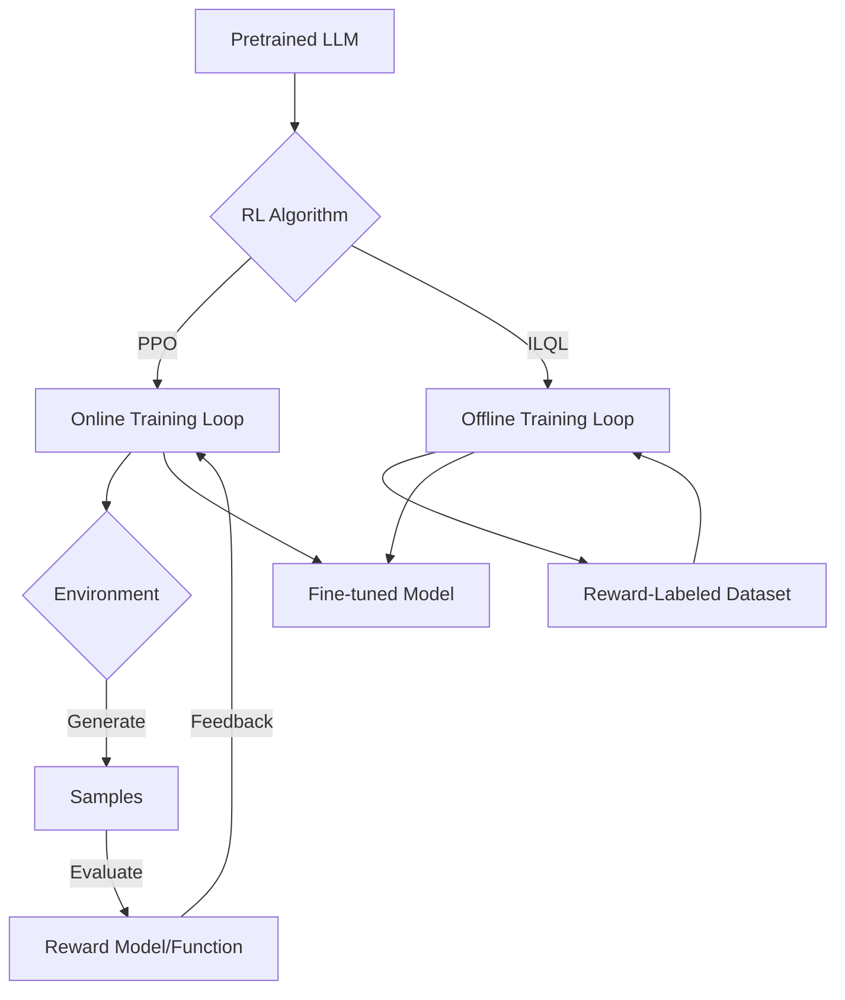

# Learn trlX in 60 Minutes

<!-- toc -->

- [1. Introduction](#1-introduction)
- [2. Problem Statement](#2-problem-statement)
- [3. Alternatives Analysis](#3-alternatives-analysis)
- [4. Architecture and Visual Flow](#4-architecture-and-visual-flow)
- [5. Native API Reference](#5-native-api-reference)
- [6. Project Extensions: Direct Preference Optimization (DPO)](#6-project-extensions-direct-preference-optimization-dpo)
- [7. Example Use Case: RLHF News Summarization System](#7-example-use-case-rlhf-news-summarization-system)
- [8. References](#8-references)

<!-- tocstop -->

## 1. Introduction

**trlX** (Transformer Reinforcement Learning X) is a distributed training framework designed to fine-tune Large Language Models (LLMs) using Reinforcement Learning (RL). Developed by CarperAI, it focuses on scaling RLHF (Reinforcement Learning from Human Feedback) to large models, supporting architectures up to 20 billion parameters and beyond.

The framework supports state-of-the-art RL algorithms including:
- **PPO** (Proximal Policy Optimization)
- **ILQL** (Implicit Language Q-Learning)

It provides seamless integration with **Accelerate** for Hugging Face models and **NVIDIA NeMo** for massive-scale training.

## 2. Problem Statement

Fine-tuning Large Language Models with Reinforcement Learning is a complex and computationally intensive process. Standard deep learning libraries often lack the specialized distributed capabilities required for large-scale RLHF or do not implement specific algorithms like ILQL that are optimized for language tasks.

**trlX addresses these challenges by providing:**

1.  **Scalability**: It enables multi-GPU and multi-node training through integration with Hugging Face Accelerate and NVIDIA NeMo.
2.  **Abstraction**: It offers a high-level API that abstracts the complexities of the Reinforcement Learning loop, making it accessible to researchers and engineers.
3.  **Flexibility**: It supports both online RL (using reward functions) and offline RL (using reward-labeled datasets).

## 3. Alternatives Analysis

The following table compares trlX with other popular libraries in the ecosystem.

| Library | Pros | Cons |
| :--- | :--- | :--- |
| **trlX** | Optimized for distributed training; supports ILQL; integrates with NeMo for large scale. | Less active maintenance recently compared to Hugging Face TRL. |
| **Hugging Face TRL** | Tightly integrated with the Hugging Face ecosystem; active development; supports DPO and PPO. | Historically focused on smaller scales, though capabilities are expanding. |
| **RL4LMs** | Modular design; excellent for benchmarking different algorithms. | Less focus on massive-scale distributed training. |
| **Void** | Lightweight and easy to understand codebase. | Limited feature set compared to trlX or TRL. |

## 4. Architecture and Visual Flow

The following diagram illustrates the training flow within trlX, showing how it handles both online (PPO) and offline (ILQL) learning paradigms.



## 5. Native API Reference

The core entry point for the library is the `trlx.train` function.

### Main Function

```python
trlx.train(
    model_path: str,
    reward_fn: Callable = None,
    samples: List[str] = None,
    rewards: List[float] = None,
    config: TRLConfig = None,
    ...
)
```

**Parameters:**

- **`model_path`**: The identifier for the model (e.g., `gpt2`, `facebook/opt-1.3b`) or a local path.
- **`reward_fn`**: A function that accepts a list of string samples and returns a list of scalar rewards. This is used for PPO.
- **`samples` & `rewards`**: Lists of strings and their corresponding scores. These are used for ILQL or offline RL.
- **`config`**: A configuration object that controls hyperparameters and training settings.

### Configuration

Configuration is managed via the `TRLConfig` object, which allows for fine-grained control over the training process.

```python
from trlx.data.default_configs import default_ppo_config

config = default_ppo_config()
config.train.seq_length = 1024
config.train.batch_size = 4
```

## 6. Project Extensions: Direct Preference Optimization (DPO)

While `trlx` natively supports PPO and ILQL, this project extends the framework to support **Direct Preference Optimization (DPO)**.

### What is DPO?
DPO is a stable and efficient alternative to PPO for aligning LLMs with human preferences. Instead of training a separate reward model and using reinforcement learning, DPO optimizes the policy directly on preference data (pairs of chosen and rejected responses).

### Implementation in this Project
We have implemented a custom trainer `AccelerateDPOTrainer` in `trlx_custom/trainer/accelerate_dpo_trainer.py`. This trainer inherits from `AccelerateRLTrainer` and overrides the loss calculation to use the DPO objective:

$$ \mathcal{L}_{DPO} = - \mathbb{E}_{(x, y_w, y_l) \sim \mathcal{D}} \left[ \log \sigma \left( \beta \log \frac{\pi_\theta(y_w|x)}{\pi_{ref}(y_w|x)} - \beta \log \frac{\pi_\theta(y_l|x)}{\pi_{ref}(y_l|x)} \right) \right] $$

### Usage
To use the DPO trainer, we register it with `trlx` and use a `DPOConfig`:

```python
from trlx_custom.trainer.accelerate_dpo_trainer import DPOConfig

config = DPOConfig(
    beta=0.1,
    gen_kwargs={"max_new_tokens": 128}
)

# Training is launched similarly to standard trlx
trainer = trlx.train(..., config=config)
```

## 7. Example Use Case: RLHF News Summarization System

`trlx` (extended with DPO) can be integrated into real-world pipelines. One such example is this project.

### Project: RLHF News Summarization System

**Objective:**
Generate concise, factual, and human-aligned summaries of news articles by retrieving relevant context and feeding it into a DPO-optimized T5 model.

**Process:**

1.  **Query Input**: A user submits a query (e.g., "What are the latest developments in AI?") via the web interface.
2.  **Retrieval (RAG)**: The system embeds the query and searches the Postgres vector database for the most relevant news articles.
3.  **Context Aggregation**: The retrieved articles are combined to form a context window.
4.  **Generation**: This context is passed to the T5-Large model, which has been fine-tuned using DPO to prefer summaries that are concise and grounded in the text.
5.  **Output**: The model generates a summary, which is displayed to the user along with citations for the retrieved sources.

**Example Prompt Summary:**

> **User**: "Summarize the impact of climate change on polar bears."
>
> **System**: "Climate change is causing a rapid decline in sea ice, which is the primary habitat for polar bears. This loss of ice forces bears onto land for longer periods, leading to malnutrition and decreased reproductive rates. Recent studies indicate that if current warming trends continue, polar bear populations could face near-extinction by the end of the century."

This demonstrates the value of using RLHF/DPO to ensure model outputs are not just accurate, but also aligned with human preferences for style and brevity.

## 8. References

- [trlX GitHub Repository](https://github.com/CarperAI/trlx)
- [Proximal Policy Optimization (PPO) Paper](https://arxiv.org/abs/1707.06347)
- [Implicit Language Q-Learning (ILQL) Paper](https://arxiv.org/abs/2206.11871)
